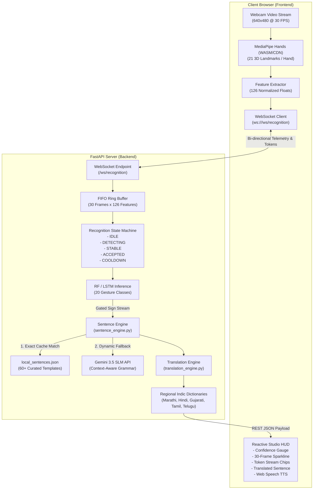

# Signova / SignBridge Studio — Comprehensive Project Architecture

> **System Blueprint & Technical Specification for Claude**  
> *Real-Time Vision-Based Sign Language Recognition & Regional Indic Speech Translation*

---

## 1. High-Level System Architecture

Signova translates live sign language gestures into fluent regional speech with sub-50ms latency. The system operates on a hybrid architecture combining client-side optical tracking, asynchronous WebSocket frame streaming, temporal LSTM inference, rule-based exact SLM sentence reconstruction with Gemini fallback, and regional Indic translation.



---

## 2. Detailed Pipeline Stages: End-to-End Dataflow

### Stage 1: Optical Tracking (Client-Side)
- **Source**: Native HTML5 `navigator.mediaDevices.getUserMedia` (`640x480`, aspect ratio 4:3, mirrored).
- **Processing**: MediaPipe Hands evaluates video frames at 30 FPS in real time.
- **Coordinate Space**: 21 landmarks per hand. Each landmark provides normalized `(x, y, z)`.
- **Vector Serialization**:
  - Left hand: $21 \times 3 = 63$ floats (zero-filled if absent).
  - Right hand: $21 \times 3 = 63$ floats (zero-filled if absent).
  - Total per frame: **126 float feature vector**.
  - Sorted by horizontal coordinate ($x$) to guarantee hand consistency.

### Stage 2: Streaming Transport & Frame Ingestion
- Frames are serialized as JSON packets over `ws://${host}/ws/recognition`:
  ```json
  {
    "type": "frame",
    "packet_id": 1042,
    "landmarks": [0.45, 0.23, -0.01, "... 126 floats ..."],
    "timestamp": 1727715000.123
  }
  ```
- Backend stores the last 30 feature vectors in a rolling deque: shape `(1, 30, 126)`.

### Stage 3: Temporal Machine Learning Inference
- **Model**: Keras Sequential LSTM with Dropout regularization:
  - `LSTM(64, return_sequences=True, input_shape=(30, 126))` + Dropout(0.3)
  - `LSTM(128, return_sequences=True)` + Dropout(0.3)
  - `LSTM(64, return_sequences=False)` + Dropout(0.3)
  - `Dense(64, activation='relu')` + Dropout(0.2)
  - `Dense(20, activation='softmax')`
- **Alternative**: Scikit-Learn Random Forest (`gesture_model.pkl`) for low-power edge compute.
- **Trained Vocabulary (20 Classes)**:
  `hello`, `yes`, `no`, `please`, `thankyou`, `water`, `food`, `help`, `stop`, `good`, `bad`, `more`, `where`, `what`, `name`, `home`, `school`, `doctor`, `pain`, `happy`.

### Stage 4: Recognition State Machine & Gating
To eliminate flicker and duplicate triggers, the backend executes `RecognitionStateMachine`:
- **IDLE**: Hand not detected or frame buffer has $< 15$ frames.
- **DETECTING**: Top class probability $\ge 0.50$ (`reject_threshold`).
- **STABLE**: Top class remains identical for $\ge 8$ consecutive frames (`target_stable_frames`) with confidence $\ge 0.70$ (`accept_threshold`).
- **ACCEPTED**: Gesture emitted once to active session buffer. HUD telemetry notified.
- **COOLDOWN**: 8-frame lockout prevents immediate repeat of identical sign unless a 1200ms boundary pause elapses.

### Stage 5: Sentence Reconstruction (Small Language Model)
- Input: Array of sign tokens in active buffer (e.g. `['help', 'doctor', 'pain']`).
- **Tier 1 (Instant Local SLM)**: Matches against `backend/data/local_sentences.json`.
  - Keys are space-separated sorted tokens.
  - Matches: `"I need help from a doctor because I am in pain."`
  - Latency: $< 1\text{ ms}$. Zero network requirement.
- **Tier 2 (Cloud SLM Fallback)**: If sequence is novel, calls Gemini 3.5 Flash via REST with constrained system prompt to reconstruct natural assistive sentences.
- **Monotonic Versioning**: Every reconstruction increments `version_id`. Client discards older out-of-order packets.

### Stage 6: Regional Indic Translation & Speech Synthesis
- English sentence is translated to 5 Indian languages:
  1. **Marathi (मराठी)**: `मला वेदना होत असल्याने मला डॉक्टरांकडून मदत हवी आहे.`
  2. **Hindi (हिंदी)**: `मुझे दर्द हो रहा है इसलिए मुझे डॉक्टर से मदद चाहिए।`
  3. **Gujarati (ગુજરાતી)**: `મને ડૉક્ટરની મદદ જોઈએ છે કારણ કે મને દુखાવો થાય છે.`
  4. **Tamil (தமிழ்)**: `எனக்கு வலி இருப்பதால் மருத்துவரிடம் உதவி தேவை.`
  5. **Telugu (తెలుగు)**: `నాకు నొప్పిగా ఉన్నందున డాక్టర్ సహాయం కావాలి.`
- Client voices translation using browser native `window.speechSynthesis` (Web Speech API).

---

## 3. Modification Safety Matrix (Critical for Claude)

When improving the UI, animations, styles, or adding features, refer to this strict demarcation:

| Component / File | Safety Status | What You CAN Do | What You MUST NOT Do |
| :--- | :--- | :--- | :--- |
| **`frontend/style.css`** | 🟢 **SAFE TO EDIT** | Redesign visual themes, animations, micro-interactions, layout grids, spacing, fonts, button hover states, card shadows, responsive rules. | Do not remove `--font-*` or core color tokens without maintaining CSS fallbacks. |
| **`frontend/index.html`** | 🟡 **EDIT WITH CARE** | Improve markup structure, rearrange panels, enhance cards, add new modals, adjust text copy, add SVG graphics or icons. | **NEVER alter or remove existing element IDs** (`#webcam`, `#landmark-canvas`, `#camera-idle-placeholder`, `#ai-sentence-display`, `#translation-display`, `#detected-signs-chips`, `#raw-model-sequence`, `#telemetry-confidence-pct`, etc.). |
| **`frontend/app.js`** | 🟡 **EDIT WITH CARE** | Enhance UI event listeners, animation triggers, HUD visual drawing, modal transitions, toast notifications, sound effects. | **DO NOT modify**: MediaPipe coordinate extraction math, WebSocket frame packet structure, or monotonic version filtering logic. |
| **`backend/app.py`** | 🔴 **DO NOT TOUCH** | Add new complementary REST routes if requested. | Do NOT alter existing WebSocket JSON message format, camera streaming endpoints, or CORS middleware. |
| **`ml/recognition/`** | 🔴 **DO NOT TOUCH** | Read only to understand inference math and state machine thresholds. | Do NOT change state machine transition states, buffer shape `(1, 30, 126)`, or gating logic. |
| **`backend/data/`** | 🟢 **SAFE TO EXPAND** | Add new vocabulary tokens, sentence templates, or language translations to `local_sentences.json`. | Do not corrupt the JSON structure or remove existing 20 baseline vocabulary entries. |
| **`tests/`** | 🔴 **DO NOT TOUCH** | Run tests to verify zero regressions (`python tests/run_all_tests.py`). | Do NOT modify assertions or weaken test thresholds. |

---

## 4. Contract IDs Reference Table

The following HTML element IDs are hard contracts referenced by both JavaScript event handlers and automated unit/E2E test suites:

| Contract ID | Element Type | Function / Role |
| :--- | :--- | :--- |
| `webcam` | `<video>` | Live camera capture stream |
| `landmark-canvas` | `<canvas>` | 2D canvas aligned over video for landmark drawing |
| `camera-idle-placeholder`| `<div>` | Inactive camera placeholder overlay |
| `btn-toggle-camera` | `<button>` | Starts / stops webcam stream |
| `btn-toggle-landmarks`| `<button>` | Toggles landmark mesh visibility |
| `btn-toggle-pause` | `<button>` | Pauses / resumes frame streaming |
| `hud-buffer-counter` | `<span>` | Buffer progress counter display (`n / 20`) |
| `telemetry-confidence-pct`| `<span>`| Top gesture confidence percentage |
| `telemetry-top-gesture-name`| `<span>`| Name of currently recognized gesture |
| `ai-sentence-display`| `<div>` | Container displaying reconstructed English sentence |
| `translation-display`| `<div>` | Container displaying regional translated text |
| `select-target-lang` | `<select>` | Language selector (Marathi, Hindi, Gujarati, Tamil, Telugu) |
| `detected-signs-chips`| `<div>` | Visual chips list of recognized signs in buffer |
| `raw-model-sequence` | `<span>` | Raw monospace text sequence of accepted tokens |
| `btn-undo-sign` | `<button>` | Removes last sign from buffer and regenerates sentence |
| `btn-clear-buffer` | `<button>` | Flushes entire session buffer |
| `btn-speak-sentence` | `<button>` | Triggers English TTS voicing |
| `btn-speak-translation`| `<button>` | Triggers Indic TTS voicing |
